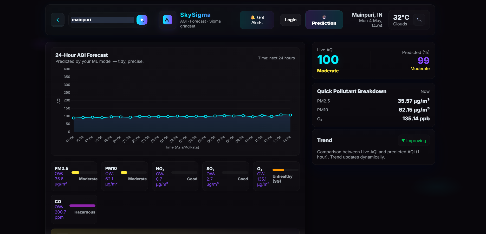
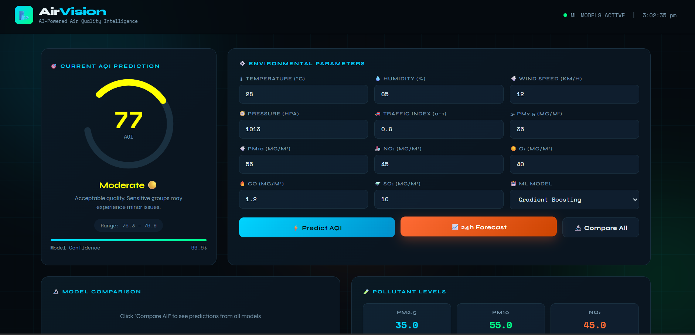

# 🌿 AirVision – Smart Air Quality Monitoring & Prediction System

AirVision is a hybrid **IoT + Machine Learning + Cloud-based** air quality monitoring system designed to provide:

* 🌍 Outdoor AQI prediction
* 🏠 Real-time indoor air quality monitoring
* 📊 Live dashboard visualization
* ☁️ Cloud-based data synchronization

The project integrates:

* ESP32 IoT hardware
* Firebase cloud integration
* Machine Learning models
* AQI APIs
* Flask backend
* Interactive frontend dashboard

---

# 🚀 Features

## 🌍 Outdoor AQI Monitoring

* CPCB API integration
* OpenWeather fallback API
* Real-time pollutant fetching
* AQI prediction using ML models
* CSV dataset generation and cleaning

---

## 🏠 Indoor AQI Monitoring

* Real-time sensor monitoring using ESP32
* Dust, gas, temperature, and humidity tracking
* OLED display output
* Firebase Realtime Database integration
* Live AQI dashboard updates

---

## 📊 Dashboard Features

* Real-time AQI display
* Indoor + outdoor monitoring
* Live graphs using Chart.js
* AQI visualization
* Responsive UI

---

# 🧠 Machine Learning Models

The project evaluates and utilizes:

* Random Forest Regressor
* Gradient Boosting Regressor
* Deep Neural Network (Research & Comparison)

## ✅ Final Selected Model

### Random Forest Regressor

Selected because of:

* Better performance on small datasets
* Reduced overfitting
* Faster prediction speed
* Simpler implementation

---

# 📊 Model Performance

| Model                       | Performance   |
| --------------------------- | ------------- |
| Random Forest Regressor     | Best Overall  |
| Gradient Boosting Regressor | Good Accuracy |
| Deep Neural Network         | Experimental  |

---

# 🔌 Hardware Components

| Component              | Purpose                           |
| ---------------------- | --------------------------------- |
| ESP32                  | Main microcontroller              |
| MQ135 Gas Sensor       | Gas & pollution detection         |
| DHT11 Sensor           | Temperature & humidity monitoring |
| GP2Y1010AU Dust Sensor | Dust / particulate monitoring     |
| 0.96-inch OLED Display | Real-time local display           |

---

# ☁️ Technologies Used

## Backend

* Flask
* SQLite

## Machine Learning

* scikit-learn
* Pandas
* NumPy
* Matplotlib

## Frontend

* HTML5
* CSS3
* JavaScript
* Chart.js

## IoT & Cloud

* Firebase Realtime Database
* ESP32 Wi-Fi Communication
* REST APIs

---

# 🌐 APIs Used

| API                    | Purpose                     |
| ---------------------- | --------------------------- |
| CPCB API (data.gov.in) | Outdoor AQI data            |
| OpenWeather API        | Backup pollutant data       |
| Firebase REST API      | Real-time IoT communication |

---

# ⚙️ System Architecture

```text
Indoor Sensors
(MQ135 + DHT11 + Dust Sensor)
            ↓
          ESP32
            ↓
        Firebase
            ↓
      Web Dashboard
            ↓
     Real-time AQI

--------------------------------

CPCB API / OpenWeather API
            ↓
      Flask Backend
            ↓
     ML Prediction Model
            ↓
      AQI Forecasting
            ↓
      Dashboard Display
```

---

# 📊 Indoor AQI Calculation

Indoor AQI is estimated using:

```text
AQI = (Dust × 1.2) + (Gas × 0.05)
```

Where:

* Dust sensor approximates particulate concentration
* MQ135 estimates gas pollution levels
* Sensor smoothing reduces fluctuations

---

# 🧹 Data Cleaning & Preprocessing

The system performs:

* Missing value handling
* Sensor smoothing
* Outlier removal
* Data normalization
* CSV generation
* Structured pollutant formatting

---

# 📁 Project Structure

```text
AirVision/
│
├── backend/
│   ├── app.py
│   ├── fetch_data.py
│   ├── models/
│
├── frontend/
│   ├── index.html
│   ├── dashboard.html
│   ├── css/
│   ├── js/
│
├── README.md
├── requirements.txt
├── .gitignore
```

---

# 📦 Requirements

* Python 3.10+
* ESP32 Board
* Arduino IDE
* Firebase Account
* Internet Connection

---

# 🔐 Environment Variables

Create a `.env` file and add:

```env
OPENWEATHER_API_KEY=your_api_key
FIREBASE_URL=your_firebase_url
```

---

# ⚡ Installation & Setup

## 1️⃣ Clone Repository

```bash
git clone https://github.com/divyansh224/AirVision-AQI-System.git
```

---

## 2️⃣ Open Project Folder

```bash
cd AirVision-AQI-System
```

---

## 3️⃣ Create Virtual Environment

```bash
python -m venv .venv
```

---

## 4️⃣ Activate Virtual Environment

### Windows

```bash
.venv\Scripts\activate
```

### Linux / Mac

```bash
source .venv/bin/activate
```

---

## 5️⃣ Install Dependencies

```bash
pip install -r requirements.txt
```

---

## 6️⃣ Run Flask Server

```bash
python backend/app.py
```

---

# 📸 Project Screenshots

## 🌐 Main Dashboard



---

## 🏠 Indoor Air Quality Dashboard


---

## 📊 AQI Prediction Dashboard



---

## 🔌 IoT Hardware Setup


---

# 🔥 Key Advantages

* Real-time indoor monitoring
* Personalized air quality tracking
* Cloud-based architecture
* Multi-API reliability
* Machine learning prediction
* Live dashboard visualization
* Hybrid IoT + ML implementation

---

# 📈 Future Improvements

* Mobile application integration
* Smart alerts and notifications
* AWS IoT deployment
* EPA-standard AQI calculations
* Multi-device monitoring
* Advanced deep learning models

---

# 🔬 Research Contribution

This project explores the integration of:

* IoT sensing systems
* Cloud-based synchronization
* Machine learning prediction
* Environmental monitoring

for intelligent and real-time AQI analysis.

---

# 🎯 Project Goal

The goal of AirVision is to provide a complete, intelligent, and real-time air quality monitoring platform by combining:

* IoT sensing
* Cloud communication
* Machine learning prediction
* Data visualization

to improve environmental awareness and health monitoring.

---

# 👨‍💻 Developed By

**Divyansh Kumar**

---

# 📜 License

This project is developed for educational and research purposes.
